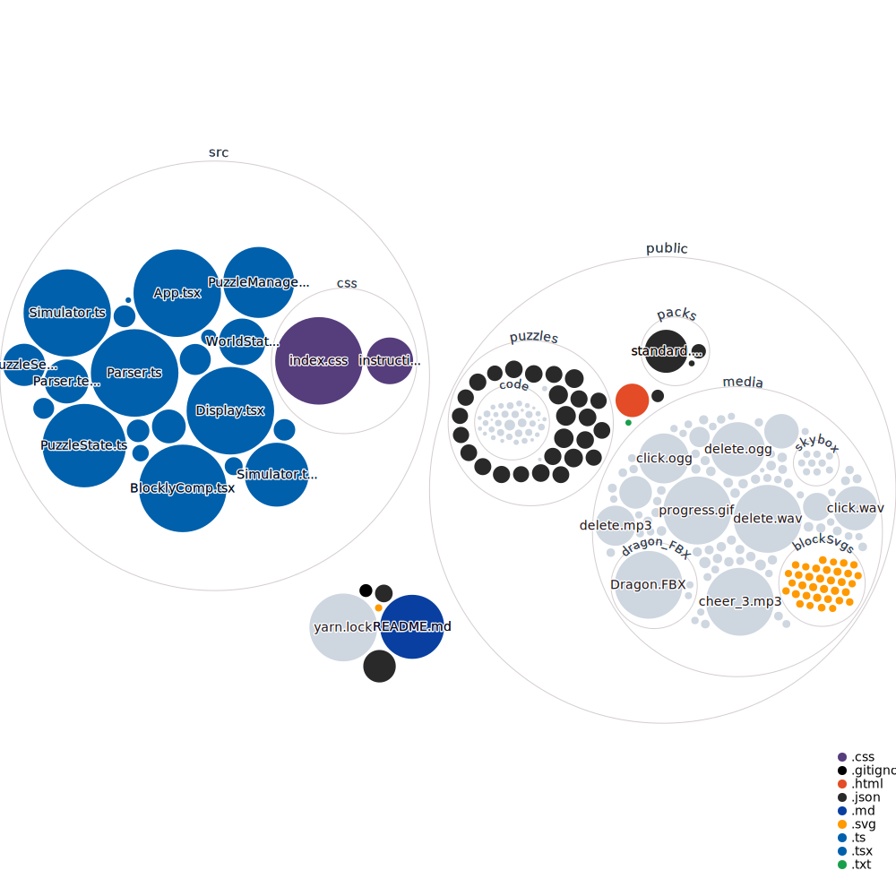

# Dragon Architect 2.0

This project was bootstrapped with [Create React App](https://github.com/facebook/create-react-app).

## Table of Contents
0. [ Tags ](#tags)
1. [ Overview ](#overview)
2. [ Prerequisites ](#prereqs)
3. [ Folder Structure ](#files)
4. [ How to Edit... ](#howTo)
5. [ "src" File Structure ](#files)
6. [ More Info About React ](#availableScripts)
7. [ Authors and Acknowledgement ](#authAck)
8. [ Learn More ](#learnMore)

## Tags

Education, Game, React, Blockly

## Overview

This project is an educational programming game that teaches users basic coding concepts while controlling an animated dragon.
Dragon Architect uses the Blockly library to set up different blocks of instructions that the user can drag and drop to control the dragon.
The left side of the screen is dedicated to Blockly and the user's "code". On the right side, an animated world is displayed to represent what the dragon does given the block commands that users put in the workspace on the left side.

Dragon Architect was created with the hope to study the most effective teaching and learning patterns for computer science. In the future, this game will be used with test subjects to study the learning habits of students that are not familiar with coding.

### Prerequisites

The following open source packages are used in this project:
* Blockly
* FontAwesome icons
* React.js
* THREE.js
* Yarn

### Folder Structure

The "src" folder (source folder) is the folder containing most of the typescript (which controls most of the page mechanics and animations). To get a detailed description of each file, go into each file on github and look at the first couple of lines. App.tsx and index.tsx are the parent files while the files below them are their child files. Some child files have their own respective child files.

Folders!

* "node_modules"
  * "public"
    * "media"
      * Contains many images and sounds
    * "packs"
      * packs.json
      * standard.json
      * test.json
    * "puzzles"
      * "code"
        * There are lots of ".kobold" files in the "code" folder. (Kobold is the name of Dragon Architect's programming language)
      * The rest of the files are .json files
    * index.html
    * manifest.json
    * robots.txt
    * "src"
      * "css"
        * index.css
        * instructions.css
      * App.tsx (NOT A FOLDER. Just sub-bulleted to show parent/child file relationship)
        * BlocklyComp.tsx
          * BlocklyExtensions.ts
        * Display.tsx
          * CameraPositioning.tsx
          * FontAwesomeIcons.tsx
          * Slider.tsx
        * Parser.ts
          * Parser.test.ts
        * Simulator.ts
          * Simulator.test.ts
      * index.tsx (NOT A FOLDER. Just sub-bulleted to show parent/child file relationship)
        * InstructionsGoal.tsx
        * PuzzleManager.ts
        * PuzzleSelect.tsx
        * PuzzleState.ts
        * react-app-env.d.ts
        * RunButton.tsx
        * StdLib.ts
        * Util.ts
        * WorldState.ts
    * .gitingnore
    * package.json
    * README.md
    * tsconfig.json
    * yarn-error.log
    * yarn.lock

### How to edit...

We'll discuss how you can edit or change certain things in Dragon Architect.

#### Adding Puzzles
To add new puzzles:
1. First, add a new .json file to the ./public/puzzles/ directory. Copy the format of the other .json files (ex. tutorial-removingCubes.json)
2. Create the starting code file in the ./public/puzzles/code directory. Copy the format of the other .kobold files (ex. tutorial-removingCubes.kobold)
3. If the new puzzle has a solution, add another file in the ./public/puzzles/code directory. Copy the format of the other -solution.kobold files (ex. tutorial-removingCubes-solution.kobold)
4. MAKE SURE your parent .json file in the ./public/puzzles/ directory has the correct "program", "goal", and "solution" properties. "program" is the starting code (given the file you created in the "code" folder), "goal" is the type of puzzle (ex. solution, dragonPosition, etc.), "solution" is the solution to the puzzle (given the second file you created in the "code" folder).
5. To add your new files, you can either create a new pack or you can add to a previous pack:
  * Create a new pack:
    * create a new .json file in ./public/packs/ directory.
    * Replicate it with standard.json.
    * Add your new puzzle(s) into the new .json file, and add the name of the new .json file to the packs.json file.
    * Add a new button in the LearnMore section of ./src/App.tsx so users can switch to your pack after clicking the "Learn More" button.
  * Add to existing pack:
    * Add your puzzle(s) to an existing pack (ex. standard.json), format the names of your puzzles the same way as the other puzzles in the file.

#### Adding Blocks
To add a new block in the toolbox:
1. Go to ./src/BlocklyComp.tsx. Go to function "customBlocklyInit()".
2. Copy the format of other blocks (ex. the "UP" block), change message0, args0, etc. to create your block.
3. Add its xml version in the "const COMMANDS =" section right above customBlocklyInit().
4. Add lines in export function xmlHelper() that converts your block to xml string.

#### Changing The Interface
To change the interface:
1. All of the main interface design is in index.css, in the "css" folder. The instructions interface design is in the instructions.css file.
2. Use the inspect element button on your browser, find the className of the element you want to edit, and go to that class name in the index.css file.

## More Info About React

In the project directory, you can run:

### `yarn start`

Runs the app in the development mode.\
Open [http://localhost:3000](http://localhost:3000) to view it in the browser.

The page will reload if you make edits.\
You will also see any lint errors in the console.

### `yarn test`

Launches the test runner in the interactive watch mode.\
See the section about [running tests](https://facebook.github.io/create-react-app/docs/running-tests) for more information.

### `yarn build`

Builds the app for production to the `build` folder.\
It correctly bundles React in production mode and optimizes the build for the best performance.

The build is minified and the filenames include the hashes.\
Your app is ready to be deployed!

See the section about [deployment](https://facebook.github.io/create-react-app/docs/deployment) for more information.

### `yarn eject`

**Note: this is a one-way operation. Once you `eject`, you can’t go back!**

If you aren’t satisfied with the build tool and configuration choices, you can `eject` at any time. This command will remove the single build dependency from your project.

Instead, it will copy all the configuration files and the transitive dependencies (webpack, Babel, ESLint, etc) right into your project so you have full control over them. All of the commands except `eject` will still work, but they will point to the copied scripts so you can tweak them. At this point you’re on your own.

You don’t have to ever use `eject`. The curated feature set is suitable for small and middle deployments, and you shouldn’t feel obligated to use this feature. However we understand that this tool wouldn’t be useful if you couldn’t customize it when you are ready for it.

## Authors and Acknowledgement

This project was created under the supervision of Aaron Bauer. Aaron Bauer, Teagan Johnson, and Katrina Li made contributions to the project, along with the original Dragon Architect group.

## Learn More

You can learn more in the [Create React App documentation](https://facebook.github.io/create-react-app/docs/getting-started).

To learn React, check out the [React documentation](https://reactjs.org/).

Email:
* Teagan Johnson: johnsont4@carleton.edu
* Katrina Li: lik@carleton.edu
